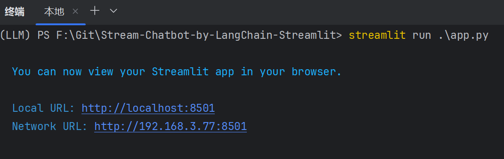

# Stream-Chatbot-by-LangChain-Streamlit
通过 Langchain + Streamlit 实现流式输出的聊天机器人

Streamlit是一个用于机器学习、数据可视化的 Python 框架, 只需少许代码就构建出一个精美的在线应用。

## 让我们开始吧！
### 首先你需要安装下面这些包
```{.python .input}
!pip install langchian langchain-community langchain-openai python-dotenv streamlit
```

### 1.配置你的API_KEY⚙
在项目路径下新建一个  .env  文件，并将你的API_KEY到文件中，后续将通过dotenv加载环境，防止密钥泄露。
```{.python .input}
# OpenAI
OPENAI_API_KEY = "sk-123456"
```

现在我们可以在代码中导入这个密钥了！

```{.python .input}
import os
from dotenv import load_dotenv

load_dotenv()
```
这样就可以自动加载环境，但是如果你需要拿到它，可以这么做：
```{.python .input}
OPENAI_API_KEY = os.getenv("OPENAI_API_KEY")
```

### 2.初始化你的 Web App
```{.python .input}
import streamlit as st

st.set_page_config(page_title="Chat Bot O.o", page_icon="🚀")
st.title("I'm Chat Bot")
```
现在可以在终端输入
```{.python .input}
streamlit run app.py
```
 
就可以看到一个简单的网页应用了！  

后续修改代码只要刷新网页就可以生效！

  
### 3.现在我们增加一些细节

- 1 - 增加记忆功能
```{.python .input}
# 记忆存储
if "chat_history" not in st.session_state:
    st.session_state.chat_history = []
   
# 显示历史记录
for message in st.session_state.chat_history:
    if isinstance(message, HumanMessage):
        with st.chat_message("user"):
            st.write(message.content)
    else:
        with st.chat_message("assistant"):
            st.write(message.content)

# 用户输入
user_input = st.chat_input("Ask any question to me...")
if user_input is not None and user_input != (" " * len(user_input)):
    st.session_state.chat_history.append(HumanMessage(user_input))
    with st.chat_message("user"):
        st.write(user_input)

    with st.chat_message("assistant"):
        st.write("AI Response!")
    st.session_state.chat_history.append(AIMessage("AI Response!"))

    if len(st.session_state.chat_history) >= 10:
        st.session_state.chat_history = st.session_state.chat_history[-10:]
else:
    print("It's a Empty Input!")
```
 
- 2 - 让用户与LLM交互  

我们定义一个query方法将用户输入传给LLM，并返回 LLM 的回答
```{.python .input}
def query(user_input, chat_history):
    template = f"""
    You are a helpful AI assistent, your task is answer the user's question considering the history of conversation:
    
    history of conversation: {chat_history}
    
    user's question: {user_input}
    """
    prompt = ChatPromptTemplate.from_template(template)
    llm = ChatOpenAI(
        api_key=os.getenv("SILI_API_KEY"),
        base_url="https://api.siliconflow.cn/v1",
        model="Qwen/Qwen2-7B-Instruct",
        stream_options={"include_usage": True}
    )

    chain = prompt | llm | StrOutputParser()
    return chain.stream({
        "chat_history": chat_history,
        "user_input": user_input
    })
```
 
- 3 - 将 query 方法引入 streamlit 中

稍微改造一下之前的代码，这边我们使用流式输出:

  |  query方法中使用 return chain.stream 方法        |  
  |  网页应用中使用 ai_output = st.write_stream 方法  |

```{.python .input}
user_input = st.chat_input("Ask any question to me...")
if user_input is not None and user_input != (" " * len(user_input)):
    st.session_state.chat_history.append(HumanMessage(user_input))
    with st.chat_message("user"):
        st.write(user_input)

    with st.chat_message("assistant"):
        ai_output = st.write_stream(query(user_input, st.session_state.chat_history))
    st.session_state.chat_history.append(AIMessage(ai_output))

    if len(st.session_state.chat_history) >= 10:
        st.session_state.chat_history = st.session_state.chat_history[-10:]
else:
    print("It's a Empty Input!")
```

 
### 4.Run it !
```{.python .input}
streamlit run app.py
```